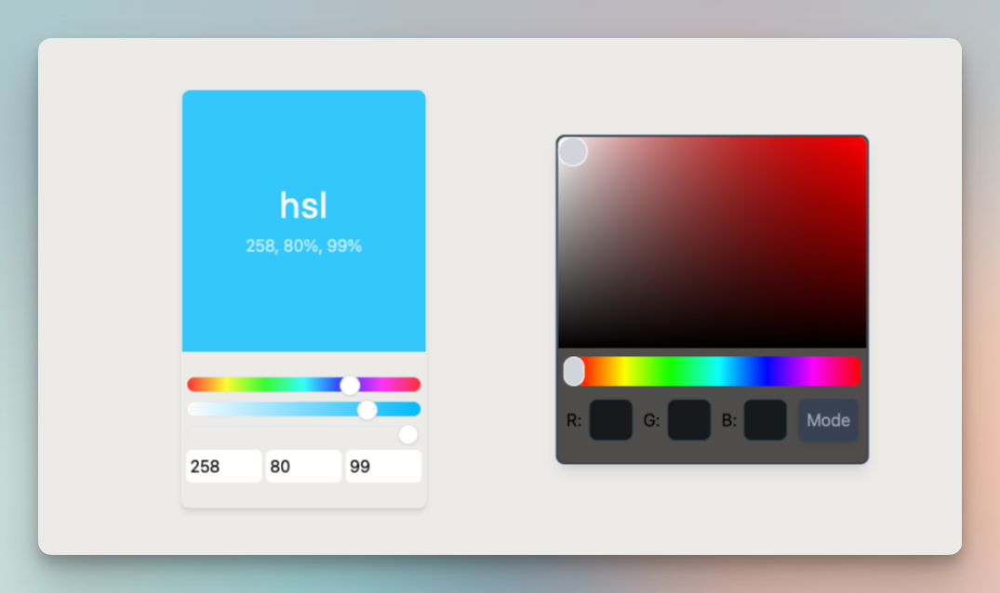

This project features two custom color selectors, developed using Tailwind CSS, Nuxt.js and TypeScript. The selectors are designed to provide a simple, intuitive experience when choosing colors for your projects.
Including :
- [Tailwind CSS](https://tailwindcss.com/)
- [Nuxt.js](https://nuxt.com/docs/getting-started/introduction)
- [TypeScript](https://tailwindcss.com/docs/installation)
- [tinycolor2](https://www.npmjs.com/package/tinycolor2)

---

## Add to your project

1. Copy the `components/ColorPicker.vue` or `components/ColorPickerItem.vue` files to your project

2. Add the following code to your component
```bash
bun i -D @types/tinycolor2
```

---

## Quick Setup

1. Clone this repository if you have access or download it from the store
```bash
git clone git@github.com:cavalluccijohann/nuxt-color-picker.git
```

2. Install dependencies
```bash
bun install
```

3. Start development server
```bash
bun dev
```

4. Generate static project
```bash
bun generate
```

5. Start production server
```bash
bun start
```

## Author

---

- [Johann Cavallucci]('https://johanncvl.com/')

